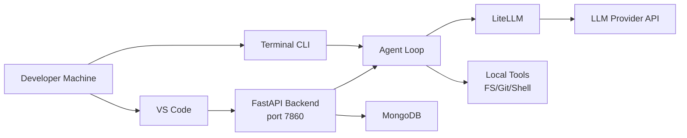
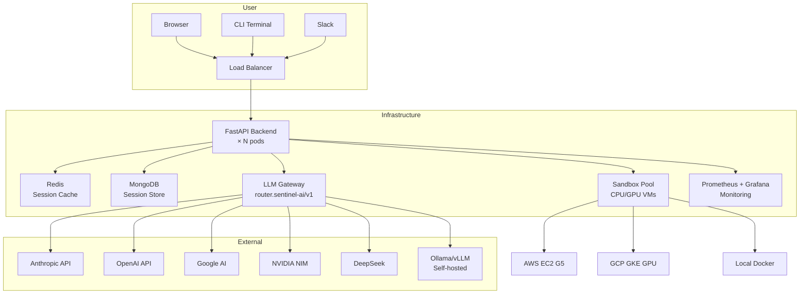

# PRODUCT REQUIREMENTS DOCUMENT — Sentinel AI
## AI Engineering Orchestrator — Investigate, Plan, Delegate via GitHub Projects

**Version:** 2.0  
**Date:** 2026-07-21  
**Status:** Draft — Pre-Launch  
**Repository:** `Single-Core-Labs/Sentinel-Agent`

---

# TABLE OF CONTENTS

1. [Executive Summary & Vision](#1-executive-summary--vision)
2. [System Architecture](#2-system-architecture)
3. [Agent Brain & Core](#3-agent-brain--core)
4. [Workflows](#4-workflows)
5. [What's Working vs What's Broken](#5-whats-working-vs-whats-broken)
6. [Launch Scope (MVP)](#6-launch-scope-mvp)
7. [GPU Access for Developers (macOS & CLI)](#7-gpu-access-for-developers-macos--cli)
8. [User Journey & UX](#8-user-journey--ux)
9. [Deployment Architecture](#9-deployment-architecture)
10. [Success Metrics & Risks](#10-success-metrics--risks)
11. [Appendix: Key File Map](#11-appendix-key-file-map)

---

# 1. EXECUTIVE SUMMARY & VISION

## One Sentence
An autonomous AI coding agent that handles any software engineering task — from writing features and debugging code to deploying infrastructure and analyzing data — using real tools (filesystem, git, shell, cloud, APIs) while keeping a human in the loop before any destructive action.

## The Problem
Every software engineer spends hours on work that is mechanical, repetitive, or requires context-switching across a dozen tools: debugging crashes, writing boilerplate, reviewing PRs, searching logs, deploying fixes, refactoring code, managing infrastructure. Existing coding agents are trapped inside the IDE — they can't run shell commands, touch cloud infrastructure, query production logs, browse the web for docs, or spawn sub-agents for parallel research. And critically, they have no concept that some actions (restarting a service, scaling a deployment, applying Terraform) could take down production.

## The Solution
A unified AI teammate that operates across the full software engineering stack — code, infra, observability, research, data. It works in your terminal, in your browser, or via Slack. It researches, writes, debugs, deploys, and fixes — with mandatory human approval on anything that mutates production, and a full audit trail of every decision.

## Target Users
- **Any software engineer** who wants an AI teammate that works beyond the IDE
- **Full-stack developers** writing, debugging, and shipping features
- **Platform / DevOps engineers** managing infrastructure and deployments
- **On-call responders** wanting fast root-cause plus guarded remediation
- **ML/Data engineers** building data pipelines and model-serving infra
- **Technical leads** wanting Slack-visible, approval-gated automation for their team

## Non-Goals
- Not a general chat product (it takes actions, not just answers)
- Not a CI/CD replacement (it triggers CI, it doesn't replace it)
- Never (by design) a system that mutates production without human approval

---

# 2. SYSTEM ARCHITECTURE

## 2.1 High-Level Overview

```
┌──────────────────────────────────────────────────────────────────────┐
│                        USER INTERFACES                               │
│  ┌──────────┐  ┌──────────────┐  ┌───────────┐  ┌───────────────┐  │
│  │ Terminal │  │ Web (React)  │  │ Slack Bot │  │ Headless/CI   │  │
│  │  (Ink)   │  │  (FastAPI)   │  │ (notify)  │  │  (scripted)   │  │
│  └────┬─────┘  └──────┬───────┘  └─────┬─────┘  └──────┬────────┘  │
└───────┼───────────────┼────────────────┼───────────────┼────────────┘
        │               │                │               │
        ▼               ▼                ▼               ▼
┌──────────────────────────────────────────────────────────────────────┐
│                      PRESENTATION LAYER                              │
│  ┌──────────────────┐  ┌──────────────────┐  ┌──────────────────┐  │
│  │  Python CLI      │  │  Rust TUI        │  │  FastAPI Web     │  │
│  │  (agent/main.py) │  │  (sentinel-tui)  │  │  (backend/)      │  │
│  │  prompt_toolkit  │  │  ratatui         │  │  SSE streaming   │  │
│  └────────┬─────────┘  └────────┬─────────┘  └────────┬─────────┘  │
└───────────┼─────────────────────┼──────────────────────┼────────────┘
            │                     │                      │
            ▼                     ▼                      ▼
┌──────────────────────────────────────────────────────────────────────┐
│                       AGENT LAYER                                    │
│                                                                      │
│  ┌──────────────────────────────────────────────────────────────┐   │
│  │                  AGENT LOOP (Plan → Act → Observe)            │   │
│  │  ┌──────────────┐ ┌──────────────┐ ┌──────────────────┐      │   │
│  │  │ Context Mgr  │ │  Tool Router │ │  Model Router    │      │   │
│  │  │ · compaction │ │  · dispatch  │ │  · mechanical=cheap│    │   │
│  │  │ · diff-only  │ │  · MCP       │ │  · reasoning=strong│   │   │
│  │  │ · prompt cac.│ │  · registry  │ │  · fallback chain│     │   │
│  │  └──────────────┘ └──────┬───────┘ └──────────────────┘      │   │
│  └──────────────────────────┼────────────────────────────────────┘   │
│                             │                                        │
│  ┌──────────────────────────┼────────────────────────────────────┐   │
│  │                          ▼                                    │   │
│  │  ┌─────────────────────────────────────────────────────────┐  │   │
│  │  │                  APPROVAL GATE                           │  │   │
│  │  │  · Mandatory: restart_service, scale_deployment,        │  │   │
│  │  │    terraform_apply (cannot be bypassed)                  │  │   │
│  │  │  · Preview diff before every mutation                    │  │   │
│  │  │  · Checkpoint + rewind after approved action             │  │   │
│  │  └─────────────────────────────────────────────────────────┘  │   │
│  └────────────────────────────────────────────────────────────────┘   │
└──────────────────────────────────────────────────────────────────────┘
            │                     │                      │
            ▼                     ▼                      ▼
┌──────────────────────────────────────────────────────────────────────┐
│                        TOOL EXECUTION LAYER                          │
│                                                                      │
│  ┌──────────┐ ┌──────────┐ ┌──────────┐ ┌──────────┐ ┌──────────┐  │
│  │  Code    │ │  Infra   │ │  Obser-  │ │ Research │ │  Data/ML │  │
│  │ Tools    │ │  Tools   │ │ vability │ │  Tools   │ │  Tools   │  │
│  │ ──────── │ │ ──────── │ │ ──────── │ │ ──────── │ │ ──────── │  │
│  │ read     │ │ terraform│ │ otel     │ │ web      │ │ dataset  │  │
│  │ write    │ │ aws/gcp  │ │ grafana  │ │ search   │ │ inspect  │  │
│  │ edit     │ │ kubectl  │ │ logs     │ │ github   │ │ schema   │  │
│  │ grep     │ │ helm     │ │ metrics  │ │ papers   │ │ validate │  │
│  │ git      │ │          │ │ traces   │ │ docs     │ │          │  │
│  │ bash     │ │          │ │          │ │          │ │          │  │
│  └──────────┘ └──────────┘ └──────────┘ └──────────┘ └──────────┘  │
│                                                                      │
│  ┌──────────┐ ┌──────────┐ ┌────────────────────────────────────┐   │
│  │ Sub-     │ │ Notify   │ │  Sandbox (CPU → H200 GPU)          │   │
│  │ Agent    │ │ (Slack)  │ │  · Process isolation               │   │
│  │ Spawner  │ │          │ │  · Cost estimated up front          │   │
│  └──────────┘ └──────────┘ │  · Platform backends               │   │
│                            │  · Permission profiles             │   │
│                            └────────────────────────────────────┘   │
└──────────────────────────────────────────────────────────────────────┘
            │                     │                      │
            ▼                     ▼                      ▼
┌──────────────────────────────────────────────────────────────────────┐
│                      LLM PROVIDER LAYER                              │
│                                                                      │
│  ┌──────────┐ ┌──────────┐ ┌──────────┐ ┌──────────┐ ┌──────────┐  │
│  │ OpenAI   │ │Anthropic │ │ Google   │ │ DeepSeek │ │ NVIDIA   │  │
│  │ (GPT-4o, │ │(Claude   │ │ (Gemini  │ │(V4 Pro)  │ │ (NIM     │  │
│  │  o-series)│ │ Opus/   │ │  2.5 Pro)│ │          │ │ Nemotron)│  │
│  │          │ │ Sonnet)  │ │          │ │          │ │          │  │
│  └──────────┘ └──────────┘ └──────────┘ └──────────┘ └──────────┘  │
│  ┌──────────┐ ┌──────────┐ ┌────────────────────────────────────┐   │
│  │ GLM 5.2 │ │ Moonshot │ │  Local: Ollama/vLLM/LM Studio      │   │
│  │ (default)│ │ (Kimi    │ │  (Fully offline, no internet)      │   │
│  │          │ │  K2.7)  │ │                                      │   │
│  └──────────┘ └──────────┘ └────────────────────────────────────┘   │
└──────────────────────────────────────────────────────────────────────┘
```

## 2.2 Two Stack Architecture

The project maintains **two parallel implementations** being merged:

| Layer | Python Stack | Rust Stack | Status |
|-------|-------------|------------|--------|
| **Agent Loop** | `agent/core/agent_loop.py` | `sentinel-core/src/agent.rs` | Both functional, Rust ~55-65% parity |
| **Model Provider** | LiteLLM-based (`agent/core/llm_params.py`) | `sentinel-provider` (OpenAI + Anthropic) | Python ahead |
| **Tools** | `agent/tools/` directory | `sentinel-tools` crate | Python ahead |
| **TUI** | Ink/React (`frontend/`) | `sentinel-ai-tui` (ratatui) | Rust is skeleton |
| **Web** | FastAPI (`backend/`) | `sentinel-app-server` | Python ahead |
| **CLI** | `agent/main.py` | `sentinel-cli` | Both functional |
| **Sandbox** | None | `sentinel-sandbox` (stub) | Rust-only, partial |
| **MCP** | Partial | `sentinel-mcp` (client) | Both partial |
| **Analytics** | Telemetry module | `sentinel-analytics` | Both partial |
| **Auth** | OAuth + env vars | `sentinel-agent-identity` (JWT) | Both partial |

## 2.3 Tech Stack

| Component | Technology | Notes |
|-----------|-----------|-------|
| **Python Runtime** | Python 3.12+ / uv | Agent loop, tools, backend |
| **Rust Runtime** | Rust 2021 Edition, Bazel | High-perf crates, CLI, TUI |
| **Frontend (CLI)** | React 18 + Ink 5 + TypeScript | Terminal UI |
| **Frontend (Web)** | React + MUI 6 + Zustand 5 | Web dashboard |
| **Backend** | FastAPI + Uvicorn | REST + SSE streaming |
| **LLM Abstraction** | LiteLLM (Python) + custom (Rust) | 7+ providers |
| **Build** | Bazel + uv + npm | Multi-language build |
| **State** | SQLite (Rust), MongoDB (Python) | Session persistence |
| **Auth** | HuggingFace OAuth + JWT | Web + CLI |

---

# 3. AGENT BRAIN & CORE

## 3.1 The Agent Loop (The Brain)

The agent loop is the central nervous system. It follows a **plan → act → observe** cycle with bounded iterations.

### Python Loop (`agent/core/agent_loop.py`)

```
User Message → [ContextManager]
  ╔══════════════════════════════════════════════════════════╗
  ║            ITERATION LOOP (bounded, max 200)             ║
  ║                                                          ║
  ║  1. Cancel + compact check                               ║
  ║     ├─ Was Ctrl+C pressed? → graceful interrupt          ║
  ║     └─ Is memory >90% full? → auto-compact               ║
  ║                                                          ║
  ║  2. Doom-loop detection                                  ║
  ║     └─ Same tool+args 3×? → abort with error             ║
  ║                                                          ║
  ║  3. Model Router → pick model                            ║
  ║     ├─ Phase: plan → cheap model                         ║
  ║     ├─ Phase: act  → strong model                        ║
  ║     └─ Keyword-based step classification                 ║
  ║                                                          ║
  ║  4. LLM call (LiteLLM)                                   ║
  ║     ├─ Streaming or non-streaming                        ║
  ║     ├─ Retry 1: transient errors (5s/15s/30s backoff)    ║
  ║     ├─ Retry 2: rate limits (30s/60s backoff)            ║
  ║     ├─ Retry 3: effort config healing                    ║
  ║     └─ Retry 4: thinking signature stripping             ║
  ║                                                          ║
  ║  5. Has tool_calls?                                      ║
  ║     ├─ No  → emit done, return                           ║
  ║     └─ Yes → continue to step 6                          ║
  ║                                                          ║
  ║  6. Validate & split tool calls                          ║
  ║     ├─ Catch malformed JSON → fix and retry              ║
  ║     ├─ Auto-approve tools → parallel execute             ║
  ║     └─ Dangerous tools → require approval                ║
  ║                                                          ║
  ║  7. Approval Gate                                        ║
  ║     ├─ Mandatory list: restart_service, scale_deployment,║
  ║     │  terraform_apply → ALWAYS require human yes        ║
  ║     ├─ Preview diff shown before ask                     ║
  ║     ├─ Slack button or terminal y/n                      ║
  ║     └─ Checkpoint snapshot taken before execution        ║
  ║                                                          ║
  ║  8. Execute tools                                        ║
  ║     ├─ Safe tools run in parallel (asyncio.gather)        ║
  ║     ├─ Approved tools wait for gate                      ║
  ║     └─ Results recorded → context updated                ║
  ║                                                          ║
  ║  9. Feed results back → loop                             ║
  ║                                                          ║
  ╚══════════════════════════════════════════════════════════╝
```

### Rust Loop (`sentinel-core/src/agent.rs`)

```rust
pub struct Agent {
    provider: Arc<dyn ModelProvider>,  // LLM provider
    tools: Arc<ToolRegistry>,          // Tool definitions + execution
    config: Arc<SentinelConfig>,       // Configuration
    events: Arc<dyn EventHandler>,     // Event notifications
    prompt_manager: SystemPromptManager,
    total_prompt_tokens: AtomicU64,
    total_completion_tokens: AtomicU64,
}
```

Three run modes:
- `run()` — Non-streaming with auto-approval
- `run_with_approval()` — With user approval gate  
- `run_streaming()` — Full streaming for every LLM call

## 3.2 Two-Brain Model Routing

The Model Router classifies every step as mechanical or reasoning using keyword matching.

**Mechanical → Cheap Model** (Simple, verifiable busywork)
- Keywords: `list`, `grep`, `search`, `find`, `format`, `lint`, `check`, `count`, `read`, `cat`, `head`, `tail`, `stat`

**Reasoning → Strong Model** (Judgment-heavy thinking)
- Keywords: `plan`, `design`, `decide`, `debug`, `diagnose`, `architect`, `refactor`, `root cause`, `trade-off`, `evaluate`

Every routing decision is logged to an audit trail with step, classification, and model chosen.

## 3.3 Context Management & Compaction

| Feature | Python | Rust |
|---------|--------|------|
| Token counting | Yes (character/4 approx) | Yes (character/4 approx) |
| Auto-compaction at 90% | Yes (LLM summarization) | Stub (drop oldest 10) |
| Diff-only updates | Yes | Not implemented |
| Prompt caching | Yes (LiteLLM header) | Not implemented |
| Manual `/compact` | Yes | Not implemented |
| Compaction fallback | Graceful session termination | Not implemented |

## 3.4 Tool System Architecture

### Python Tool Router (`agent/core/tools.py`)

```
ToolRouter
├── Built-in tools (research, web search, plan, GitHub, git, subagents, local)
├── MCP tools (via FastMCP registration)
└── OpenAPI search tools (docs discovery)
```

### Rust Tool Registry (`sentinel-tools`)

```
ToolRegistry
├── register(name, description, schema, handler)
├── execute(name, args, context) → ToolOutput
├── tool_defs_for_model() → JSON Schema array
└── Permission checks (via sentinel-sandbox)
```

## 3.5 Approval Gate (Safety Layer)

Three actions that **ALWAYS require human approval** — no bypass possible:

| Action | Risk | Safety Mechanism |
|--------|------|-----------------|
| `restart_service` | Brief outage | Preview + y/n + checkpoint |
| `scale_deployment` | Changes instance count | Preview + y/n + checkpoint |
| `terraform_apply` | Rewrites cloud resources | Full diff + y/n + checkpoint |

**Three layers of protection:**
1. **Preview** — Shows exactly what would change
2. **Approval** — Slack buttons or terminal y/n
3. **Checkpoint** — State snapshot before execution, rewinds if needed

---

# 4. WORKFLOWS

## 4.1 User Onboarding Flow

```
User runs `sentinel` or `npm run cli`
        │
        ▼
  ┌─────────────────────────────────────────────────┐
  │          STARTUP SEQUENCE (~6s animation)        │
  │  · Particle ASCII logo + grid animation          │
  │  · CRT boot sequence (4 staggered lines)         │
  │  · "Press any key to skip"                       │
  └─────────────────────┬───────────────────────────┘
                        │
                        ▼
  ┌─────────────────────────────────────────────────┐
  │          PROVIDER PICKER                         │
  │  · Select AI provider: Anthropic / OpenAI /      │
  │    Google / DeepSeek / NVIDIA / Moonshot / GLM   │
  │  · Enter API key if not in env                   │
  │  · Esc to keep default (GLM 5.2)                 │
  └─────────────────────┬───────────────────────────┘
                        │
                        ▼
  ┌─────────────────────────────────────────────────┐
  │          MAIN CHAT INTERFACE                     │
  │  ┌─────────────────────────────────────────┐    │
  │  │ ChatView (scrollable event log)          │    │
  │  │ · User messages                          │    │
  │  │ · Assistant responses (streaming)        │    │
  │  │ · Tool calls and results                 │    │
  │  │ · Approval requests                      │    │
  │  │ · Error events                           │    │
  │  └─────────────────────────────────────────┘    │
  │  ┌─────────────────────────────────────────┐    │
  │  │ InputBar (multiline + slash commands)    │    │
  │  └─────────────────────────────────────────┘    │
  │  ┌─────────────────────────────────────────┐    │
  │  │ StatusBar (model/turns/tokens/mode)      │    │
  │  └─────────────────────────────────────────┘    │
  └─────────────────────────────────────────────────┘
```

## 4.2 General Coding Workflow

```
USER: "Add input validation to the API endpoint and write tests"

AGENT:
  Phase 1: PLAN
  ├── Model Router → strong model (reasoning: "design", "plan")
  ├── Reads the API endpoint file and existing tests (tool: read)
  ├── Generates plan:
  │   1. Read current endpoint implementation
  │   2. Identify validation requirements from API spec
  │   3. Implement validation with error messages
  │   4. Write unit tests covering valid/invalid cases
  │   5. Run tests to verify
  └── Emits plan_generated event

  Phase 2: ACT
  ├── Step 1: Read endpoint file (tool: read)
  │   └── Model Router → cheap model (mechanical: "read")
  │   └── Examines existing code structure
  ├── Step 2: Search for test patterns (tool: grep)
  │   └── Finds existing test examples to follow
  ├── Step 3: Edit endpoint to add validation (tool: edit)
  │   └── Adds type checks, sanitization, error responses
  ├── Step 4: Write tests (tool: write)
  │   └── Creates test file following project conventions
  ├── Step 5: Run linter (tool: bash → ruff check)
  │   └── Linter passes
  └── Step 6: Run tests (tool: bash → pytest)
      └── Tests passing ✅

  Phase 3: VERIFY
  ├── Git status + diff (tool: git)
  └── Presents changes to user for review
```

```
USER: "The deployment keeps crashing in production"

AGENT:
  Phase 1: PLAN
  ├── Model Router → strong model (reasoning: "debug", "root cause")
  ├── Generates plan:
  │   1. Check deployment status and recent changes
  │   2. Examine application logs for crash patterns
  │   3. Review metrics (CPU, memory, error rate)
  │   4. Identify root cause
  │   5. Propose fix with safety implications
  └── Emits plan_generated event

  Phase 2: ACT
  ├── Step 1: kubectl get pods --namespace production (tool: bash)
  │   └── Model Router → cheap model (mechanical: "check")
  │   └── Result: Pods CrashLoopBackOff
  ├── Step 2: kubectl logs pod/foo-xxx --previous (tool: bash)
  │   └── Result: OOMKilled — out of memory
  ├── Step 3: Check resource limits (tool: bash)
  │   └── Result: memory limit set to 64Mi
  ├── Step 4: kubectl describe deployment foo (tool: bash)
  │   └── Result: no resource requests set
  └── Step 5: Propose fix: increase memory limit to 512Mi

  Phase 3: APPROVAL
  ├── AGENT: "I need to scale deployment 'foo' — here's the diff"
  ├── Shows kubectl patch preview
  ├── USER: y (approves)
  ├── Checkpoint taken
  └── AGENT: Executes patch

  Phase 4: VERIFY
  ├── kubectl get pods (tool: bash)
  └── Result: pods Running Ready 1/1
```

## 4.3 Approval Flow (Detailed)

```
Agent needs to execute a dangerous action
        │
        ▼
  ┌─────────────────────────────────────────────────────┐
  │              APPROVAL GATE CHECK                     │
  │                                                      │
  │  Is action on mandatory list?                        │
  │  (restart_service / scale_deployment / terraform_apply)
  │       │                      │                       │
  │      YES                     NO                       │
  │       │                      │                       │
  │  ┌────▼────┐          ┌──────▼──────┐                │
  │  │ Preview │          │ Is yolo_mode│                │
  │  │ diff +  │          │ enabled?    │                │
  │  │ ask y/n │          │ ┌────┴────┐ │                │
  │  └────┬────┘          │ YES      NO │                │
  │       │               │ ┌───┐  ┌───┴───┐            │
  │       ├─ y ───────────► │ Go │  │ Ask y/n│           │
  │       │               │ └───┘  └───┬───┘            │
  │       ├─ n → rejected │            │                │
  │       │               │            ├─ y             │
  │       │               │            ├─ n → rejected  │
  │       ▼               ▼            ▼                 │
  │  ┌─────────────────────────────────────────┐        │
  │  │       CHECKPOINT SNAPSHOT                 │        │
  │  │  Save full session state (undo-able)      │        │
  │  └──────────────────┬──────────────────────┘        │
  │                     │                                │
  │                     ▼                                │
  │  ┌─────────────────────────────────────────┐        │
  │  │          EXECUTE ACTION                  │        │
  │  │  · Tool runs (parallel if safe)         │        │
  │  │  · Result fed back to agent context     │        │
  │  └─────────────────────────────────────────┘        │
  └─────────────────────────────────────────────────────┘
```

## 4.4 CI Pipeline Workflow

```
Developer commits code → GitHub
        │
        ▼
  ┌─────────────────────────────────────────────────────┐
  │              CI PIPELINE (GitHub Actions)             │
  │                                                      │
  │  1. Lint & Format                                    │
  │     ├─ uv run ruff check .                           │
  │     ├─ uv run ruff format --check .                  │
  │     ├─ cargo fmt --check                             │
  │     └─ cargo clippy                                  │
  │                                                      │
  │  2. TypeScript Type Check                            │
  │     └─ frontend: npx tsc --noEmit                    │
  │                                                      │
  │  3. Unit Tests                                       │
  │     ├─ frontend: npm test                            │
  │     ├─ backend: uv run pytest tests/unit             │
  │     └─ rust: cargo test                              │
  │                                                      │
  │  4. Build                                            │
  │     ├─ frontend: npm run build (vite)                │
  │     ├─ rust: bazel build //...                       │
  │     └─ Copy static/ → backend/static/                │
  │                                                      │
  │  5. Integration Tests                                │
  │     └─ (planned) end-to-end with real server         │
  │                                                      │
  │  6. Deploy (on main branch merge)                    │
  │     └─ main-branch.yml workflow                      │
  │                                                      │
  └─────────────────────────────────────────────────────┘
```

## 4.5 Data Flywheel (Learning Loop)

```
Every conversation
        │
        ▼
  ┌─────────────────────────────────────────────────────┐
  │              SESSION TRAJECTORY                      │
  │  · Tools used, outcome, feedback                     │
  │  · Tags: completed/errored/doom-looped               │
  │  · GPU usage, user thumbs up/down                    │
  └────────┬────────────────────────────────────────────┘
           │
           ▼
  ┌──────────────────┐    ┌────────────────────────────┐
  │ Hourly KPIs      │    │ Training Data Export        │
  │ · Usage metrics  │    │ · Raw multi-turn trajectories│
  │ · Cost tracking  │    │ · Tool-calling patterns     │
  │ · Error rates    │    │ · Success/failure pairs     │
  └────────┬─────────┘    └──────────┬─────────────────┘
           │                         │
           ▼                         ▼
  ┌─────────────────────────────────────────────────────┐
  │            SELF-IMPROVEMENT CYCLE                    │
  │  · AI reviews own PRs (with written rules)           │
  │  · Models fine-tuned on successful trajectories      │
  │  · Backlog ranked by product impact via LLM          │
  └─────────────────────────────────────────────────────┘
```

---

# 5. WHAT'S WORKING VS WHAT'S BROKEN

## 5.1 Exec Summary

| Area | Status | Working | Broken/Missing |
|------|--------|---------|----------------|
| **Python Agent Loop** | 🟢 ~95% | Full plan→act→observe, streaming, approval gate, doom-loop, compaction, retry | Image/embedded MCP handling stubbed |
| **Rust Agent Loop** | 🟡 ~60% | Core loop functional, streaming, approval gate | No session persistence, compaction is stub, no budget guard |
| **Python CLI** | 🟢 ~95% | REPL, headless, IPC mode, session mgmt | Minor edge cases |
| **Rust CLI** | 🟡 ~50% | Subcommands wired, exec path works | Mock client still default |
| **Frontend (Ink)** | 🟢 ~90% | All 7 providers, tool system, agent loop, themes, startup animation | No session persistence, no compaction UI, model-picker unreachable |
| **Backend (FastAPI)** | 🟢 ~85% | All routes, SSE streaming, session mgmt, OAuth, provider config | Missing integration tests, error response inconsistency |
| **Rust TUI** | 🔴 ~20% | App skeleton, ChatWidget stub | No scrolling, no overlays, mock only |
| **MCP Integration** | 🟡 ~40% | Python: partial registration; Rust: MCP client crate | No full discovery, no server mode |
| **Sandbox** | 🔴 ~15% | Rust crate with policy types defined | Not enforced, no platform backends |
| **GPU/Sandbox Compute** | 🔴 ~10% | Cost estimation function exists | No actual sandbox runtime, no GPU provisioning |
| **Session Persistence** | 🟡 ~50% | Python: MongoDB-based; Rust: SQLite stubbed | No e2e tests, compaction loss on restart |
| **Analytics** | 🟡 ~40% | Telemetry module (Python), sentinel-analytics (Rust) | Not full pipeline, no dashboards |
| **Auth** | 🟡 ~50% | OAuth flow, env vars, JWT (Rust) | No user info persistence (OAuth) |
| **CI/CD** | 🟡 ~50% | GitHub Actions for lint/test/build | No production build for UI static, no integration test suite |
| **Performance** | 🔴 ~20% | No profiling done | Rust migration targetting 10x perf improvement |

## 5.2 Detailed Breakdown

### 🔴 Critical Gaps (Blocking Launch)

| Gap | Component | Impact | Fix Needed |
|-----|-----------|--------|------------|
| No real sandbox/isolation | All | Tools run on host, no security boundary | Implement platform sandbox (bwrap/Seatbelt/restricted tokens) |
| No GPU provisioning | Training/sandbox | Users can't run GPU workloads via CLI | Implement sandbox with GPU backends (H200, A100, etc.) |
| Rust session persistence missing | sentinel-core | Sessions lost on restart | Implement SQLite-backed thread store |
| Production frontend build not in CI | frontend | Web UI not deployed | Add `npm run build` + copy to `backend/static/` in CI |
| No integration test harness | All | Risk of regression on refactors | Build e2e test that drives real agent loop against mocked provider |
| No cost/token budget guard in Rust | sentinel-core | Unlimited spend risk | BudgetGuard recently added (2026-07-20), needs verification |
| No LLM retry/timeout in Rust | sentinel-provider | Transient errors crash agent | Just added (2026-07-20), needs verification |

### 🟡 Partial Gaps (Should Fix Before Launch)

| Gap | Component | Current State | Fix Needed |
|-----|-----------|--------------|------------|
| MCP image/embedded content | Python tool router | Stubbed with TODOs | Implement ImageContent + EmbeddedResource handling |
| Context compaction in Rust | sentinel-ai-core | Stub that reports no-op | LLM-based summarization |
| Apply-patch safety | sentinel-ai-core | Full file overwrite | Diff parsing, line validation, Git-aware safety |
| Model picker unreachable | Frontend | model-picker.tsx exists but not wired | Wire into phase machine or remove |
| No approval UI dialog | Frontend | Approval events emitted but no UI | Add approve/reject dialog for destructive tool calls |
| OAuth user info not persisted | Backend | Auth succeeds but user metadata lost | Store user info from HF OAuth |
| Error response inconsistency | Backend | Raw exceptions in some routes | Unified ErrorResponse model |
| No auto-approval budget UI | Frontend/Backend | Budget exists in backend, not surfaced | Show budget in status bar |
| Missing key_required test | Frontend | Provider error paths not fully tested | Add tests |
| No retry/backoff in TS agent loop | Frontend | Python has it, TypeScript doesn't | Add exponential backoff |

### 🟢 Working Well (Launch Quality)

| Component | Quality | Details |
|-----------|---------|---------|
| Python Agent Loop | Production-grade | 200-iteration bounded loop, compaction, doom-loop, malformed recovery, plan mode |
| 7 Provider Support | Verified | Anthropic, OpenAI, Google, DeepSeek, NVIDIA, Moonshot, GLM via LiteLLM |
| Approval Gate | Security-hardened | Three mandatory-action rules, non-bypassable, checkpoint+rewind |
| Frontend Provider Abstraction | Well-tested | 7 providers, proper system role mapping, missing-key detection, HTTP-shape tests |
| RealEventEmitter Agent Loop | Verified (Google live key) | Plan→act→observe, tool execution, doom-loop detection, npm test feedback loop |
| Tool System | Functional | read/write/edit/grep/glob/bash — real filesystem operations |
| CLI Startup Sequence | Polished | Particle animation, CRT boot, theme support, slash commands |
| Session Manager (Python) | Production-featured | MongoDB persistence, idle reaper, concurrent sessions, usage thresholds |
| Model Routing | Smart | Mechanical vs reasoning classification, audit log |
| Data Flow | Complete | User→CLI→Agent→Tools→LLM→Result→User, with full event system |

---

# 6. LAUNCH SCOPE (MVP)

## Phase 1 — Core Agent (Current State, ~85% done)

### Must-Have for Launch
- [x] Agent loop (plan→act→observe, bounded iterations)
- [x] 7 LLM providers (Anthropic, OpenAI, Google, DeepSeek, NVIDIA, Moonshot, GLM)
- [x] Approval gate (mandatory: restart, scale, terraform_apply)
- [x] Tool system (code, infra, observability, research, data/ML)
- [x] Session management (create, resume, list, delete, undo, compact)
- [x] CLI (REPL, headless, IPC modes)
- [x] Web backend (FastAPI with SSE streaming)
- [x] Context management (auto-compaction at 90%, diff-only updates)
- [x] Doom-loop detection
- [x] Malformed tool-call recovery
- [x] Usage thresholds and spend warnings
- [x] Slash commands (/theme, /model, /new, /compact, /undo, /resume)

### Needed for Launch (Not Yet Complete)
- [ ] MCP image/embedded content handling
- [ ] Approval UI in frontend
- [ ] Session persistence end-to-end test
- [ ] Production build pipeline (static/ → backend/)
- [ ] Integration test suite
- [ ] Documentation for all 7 providers (env vars, setup)

## Phase 2 — Performance & Scale (Post-Launch Q1)

- [ ] Full Rust agent loop (replace Python)
- [ ] Platform sandboxing (bwrap, Seatbelt, restricted tokens)
- [ ] GPU sandbox provisioning (CPU→H200)
- [ ] Remote execution (SSH/WebSocket exec server)
- [ ] Multi-session horizontal scaling
- [ ] MCP server mode (expose as tool to other agents)
- [ ] Analytics pipeline (Grafana, Prometheus, tracing)

## Phase 3 — Enterprise (Post-Launch Q2+)

- [ ] Team/multi-user session sharing
- [ ] RBAC and team workspace
- [ ] Custom plugin ecosystem
- [ ] Self-hosted deployment (Helm chart)
- [ ] Compliance audit (SOC2, HIPAA)
- [ ] Custom model fine-tuning on session trajectories

---

# 7. GPU ACCESS FOR DEVELOPERS (macOS & CLI)

## 7.1 Problem Statement

macOS developers (Apple Silicon M-series) have no local GPU for ML workloads. Linux developers may have NVIDIA GPUs but no standardized way to provision them through the agent. The sandbox system is currently unimplemented.

## 7.2 Architecture: GPU Provisioning via CLI

```
┌─────────────────────────────────────────────────────────────────────┐
│                      GPU ACCESS ARCHITECTURE                         │
│                                                                      │
│  User CLI                                                             │
│  ┌──────────────────────────────────────────────────────────────┐   │
│  │  sentinel sandbox create --gpu H200 --hours 2                 │   │
│  │  sentinel sandbox create --gpu A100-80GB --hours 4            │   │
│  │  sentinel sandbox list                                        │   │
│  │  sentinel sandbox destroy <id>                                │   │
│  └─────────────────────┬────────────────────────────────────────┘   │
│                        │                                             │
│                        ▼                                             │
│  ┌──────────────────────────────────────────────────────────────┐   │
│  │                    SANDBOX ORCHESTRATOR                        │   │
│  │                                                               │   │
│  │  1. Parse request → determine GPU type + duration             │   │
│  │  2. Check budget/spend caps                                   │   │
│  │  3. Show cost estimate up front:                              │   │
│  │     ┌────────────────────────────────────┐                    │   │
│  │     │ GPU Type   | Rate        | 2h Cost │                    │   │
│  │     │────────────┼─────────────┼─────────│                    │   │
│  │     │ CPU        | FREE        | FREE    │                    │   │
│  │     │ L4         | $0.60/hr    | $1.20   │                    │   │
│  │     │ A100-80GB  | $4.00/hr    | $8.00   │                    │   │
│  │     │ H200       | $8.00/hr    | $16.00  │                    │   │
│  │     │ 8×H200     | $80.00/hr   | $160.00 │                    │   │
│  │     └────────────────────────────────────┘                    │   │
│  │  4. Request approval: "Provision H200 for 2h ($16)?"          │   │
│  │  5. On approval: provision cloud VM/container                 │   │
│  │  6. Return connection details (SSH, Jupyter URL, etc.)        │   │
│  └─────────────────────┬────────────────────────────────────────┘   │
│                        │                                             │
│                        ▼                                             │
│  ┌──────────────────────────────────────────────────────────────┐   │
│  │                    BACKEND PROVIDERS                          │   │
│  │                                                               │   │
│  │  ┌──────────────┐  ┌──────────────┐  ┌──────────────────┐    │   │
│  │  │  Cloud VM    │  │  Kubernetes  │  │  Local Docker    │    │   │
│  │  │  (AWS/GCP)   │  │  (k8s pod)   │  │  (colima/      │    │   │
│  │  │  · EC2 G5    │  │  · GPU node  │  │   podman)      │    │   │
│  │  │  · GKE node  │  │  · Spot      │  │  · Apple Metal │    │   │
│  │  │  · Spot inst.│  │  · Preempt.  │  │  · NVIDIA ctr  │    │   │
│  │  └──────────────┘  └──────────────┘  └──────────────────┘    │   │
│  └──────────────────────────────────────────────────────────────┘   │
└─────────────────────────────────────────────────────────────────────┘
```

## 7.3 macOS-Specific Strategy

Apple Silicon Macs cannot use NVIDIA GPUs. Three-tier approach:

### Tier 1: Cloud GPU (Primary — Always Works)
```
sentinel sandbox create --gpu H200
  → Provisions cloud instance (AWS/GCP)
  → Returns SSH command or Jupyter URL
  → Agent runs workloads remotely
  → Automatic cleanup after TTL
```

### Tier 2: Local Apple Metal (When Available)
```
sentinel sandbox create --gpu mps  (Metal Performance Shaders)
  → Uses local M-series GPU via PyTorch MPS backend
  → Limited to available memory (16-128GB unified)
  → No cleanup needed (local process)
  → Ideal for: small model fine-tuning, inference, debugging
```

### Tier 3: Colima/Docker (Fallback)
```
sentinel sandbox create --gpu cpu  (or no GPU flag)
  → Runs in local Docker container via Colima
  → CPU-only, good for testing workflows
  → Zero cost
```

## 7.4 CLI Commands for GPU Access

```bash
# Provision GPU sandbox
sentinel sandbox create --gpu H200 --hours 2
sentinel sandbox create --gpu A100-80GB --hours 4
sentinel sandbox create --gpu mps              # macOS Metal

# List active sandboxes
sentinel sandbox list

# Connect to sandbox (SSH)
sentinel sandbox connect <id>

# Run command on sandbox
sentinel sandbox exec <id> -- nvidia-smi

# Destroy sandbox
sentinel sandbox destroy <id>

# Estimated cost before provisioning
sentinel sandbox estimate --gpu H200 --hours 2
```

## 7.5 Agent-Integrated GPU Workflow

```
USER: "Fine-tune this model on our dataset"

AGENT:
  ├── 1. Check if GPU sandbox exists → No
  ├── 2. Estimate cost: H200 × 2h = $16
  ├── 3. Ask user: "Provision H200 GPU for 2h ($16)?"
  ├── 4. User approves
  ├── 5. Provisions sandbox + installs deps
  ├── 6. Uploads dataset + training script
  ├── 7. Runs training (streaming logs to user)
  └── 8. Downloads artifacts, destroys sandbox
```

---

# 8. USER JOURNEY & UX

## 8.1 Getting Started

```bash
# Installation
npm install -g sentinel-ai
# or
pip install sentinel-agent

# First run — guided setup
sentinel

# → Startup animation plays (6s)
# → Provider picker appears
# → Select model, enter API key
# → Chat interface loads
# → Type anything: "add validation to this API", "why is prod slow?",
#   "write a migration script", "refactor this module",
#   "help me debug this test failure"
```

## 8.2 Slash Commands

| Command | Description |
|---------|-------------|
| `/model` | Switch AI model mid-session |
| `/theme <name>` | Switch UI theme (dark/high-contrast/cyber) |
| `/new` | Start fresh conversation |
| `/compact` | Force memory compaction |
| `/undo` | Undo last turn |
| `/resume` | Resume saved session |
| `/help` | Show all commands |
| `/quit` | Exit (or Ctrl+C ×2) |

## 8.3 Interface Modes

| Mode | Entry | Use Case |
|------|-------|----------|
| **Interactive** | `sentinel` | Everyday use, full TTY |
| **Headless** | `sentinel "refactor the auth module"` | CI/automation, non-interactive |
| **Web** | `sentinel web` | Browser access, team sharing |
| **Notebook** | `sentinel notebook` | Jupyter-like exploration |
| **Slack** | `@sentinel check prod` | Alert responses on mobile |

---

# 9. DEPLOYMENT ARCHITECTURE

## 9.1 Development Setup



## 9.2 Production Deployment



## 9.3 CI/CD Pipeline

```yaml
name: CI/CD
on: [push, pull_request]
jobs:
  lint:
    - ruff check .
    - ruff format --check .
    - cargo fmt --check
    - cargo clippy
  
  test:
    - npm test  (frontend)
    - uv run pytest tests/unit  (backend)
    - cargo test  (rust)
  
  build:
    - npm run build  (frontend → dist/)
    - cp -r dist/* backend/static/
    - bazel build //crates/...
  
  deploy:
    if: github.ref == 'refs/heads/main'
    - docker build -t sentinel-ai .
    - push to registry
    - kubectl apply -f k8s/
```

## 9.4 Infrastructure Requirements

| Component | Min Spec | Recommended | Cost Estimate |
|-----------|----------|-------------|---------------|
| **Backend** | 2 CPU, 4GB RAM | 4 CPU, 8GB RAM | $50-100/mo |
| **MongoDB** | 1 CPU, 2GB RAM | 2 CPU, 4GB RAM | $15-30/mo |
| **Redis** | 1 CPU, 1GB RAM | 2 CPU, 2GB RAM | $10-20/mo |
| **LLM Gateway** | Managed | Self-hosted | $0-200/mo |
| **GPU Sandbox** | Per-use | H200/A100 | $0.60-80/hr |
| **Frontend** | Static hosting | CDN | $0-10/mo |
| **Monitoring** | Prometheus + Grafana | Managed | $0-50/mo |

---

# 10. SUCCESS METRICS & RISKS

## 10.1 Launch Success Metrics

| Metric | Target | Measurement |
|--------|--------|-------------|
| Approval compliance | 100% | No bypass incidents on mandatory actions |
| Time-to-resolution | 50% faster than manual | Comparative timing on on-call tasks |
| Cost per task | <$0.50 avg | Token audit log |
| Doom-loop rate | <5% of sessions | Auto-detected loops / total sessions |
| User satisfaction | >4/5 stars | Session feedback scores |
| Provider reliability | >99% uptime | LLM call success rate |

## 10.2 Risks & Mitigations

| Risk | Likelihood | Impact | Mitigation |
|------|-----------|--------|------------|
| Keyword classifier routes ambiguous step to weak model | Medium | Medium | Audit log + fallback to strong model on unknown keywords |
| Approval gate bypassed via code refactor | Low | Critical | Dedicated review gate on gate.py; automated tests verify non-bypassability |
| GPU sandbox cost overrun | Medium | High | Hard spend caps, warning thresholds, pre-execution cost estimates |
| LLM provider outage | Medium | High | Automatic failover, local model fallback |
| Context window exceeded | Low | Medium | Auto-compaction at 90%, graceful degradation |
| Frontend/backend version drift | Medium | Low | CI-mandated build, API versioning |

## 10.3 Open Questions

1. Should OpenRouter be offered as an alternate LLM transport?
2. What sandbox isolation boundary — per session or per tool call?
3. Multi-user session sharing roadmap?
4. Replace keyword classifier with small learned model?
5. macOS GPU via Metal vs always cloud?

---

# 11. APPENDIX: KEY FILE MAP

## Python Agent Core

| File | Purpose |
|------|---------|
| `agent/main.py` | Entry point (REPL, headless, IPC, Ink launch) |
| `agent/core/agent_loop.py` | Main agent loop (plan→act→observe, bounded iterations) |
| `agent/core/_agent_helpers.py` | LLM retry, compaction, approval, doom-loop, tool recovery |
| `agent/core/session.py` | Session class (context, tools, events, checkpoint) |
| `agent/core/model_router.py` | Mechanical/reasoning routing |
| `agent/core/tools.py` | ToolSpec + ToolRouter (built-in + MCP) |
| `agent/core/llm_params.py` | LiteLLM kwargs resolver for any model |
| `agent/core/plan.py` | Plan phase tracking |
| `agent/core/doom_loop.py` | Repeated tool-call detection |
| `agent/core/approval_policy.py` | Mandatory auto-approval set |
| `agent/core/yolo_budget.py` | Budget-based auto-approval |
| `agent/core/usage_thresholds.py` | Spend tracking + warnings |
| `agent/context_manager/manager.py` | Context compaction, token tracking |
| `agent/messaging/slack.py` | Slack notification gateway |

## Rust Crates

| Crate | Path | Purpose |
|-------|------|---------|
| `sentinel-core` | `crates/sentinel-core/` | Primary agent (Agent, AgentThread, ContextManager) |
| `sentinel-ai-core` | `crates/sentinel-ai-core/` | Lighter agent (AgentRegistry, compact stub) |
| `sentinel-provider` | `crates/sentinel-provider/` | ModelProvider trait + OpenAI/Anthropic |
| `sentinel-tools` | `crates/sentinel-tools/` | ToolRegistry, built-in tools |
| `sentinel-mcp` | `crates/sentinel-mcp/` | MCP client integration |
| `sentinel-sandbox` | `crates/sentinel-sandbox/` | Sandbox policy + platform |
| `sentinel-cli` | `crates/sentinel-cli/` | Main CLI binary |
| `sentinel-ai-tui` | `crates/sentinel-ai-tui/` | Terminal UI (ratatui) |
| `sentinel-app-server` | `crates/sentinel-app-server/` | App server |
| `sentinel-analytics` | `crates/sentinel-analytics/` | Telemetry + analytics |
| `sentinel-agent-identity` | `crates/sentinel-agent-identity/` | JWT + Ed25519 identity |
| `sentinel-protocol` | `crates/sentinel-protocol/` | Core protocol types |

## Frontend

| File | Purpose |
|------|---------|
| `frontend/src/App.tsx` | Phase machine (startup → provider → main) |
| `frontend/src/events/real-emitter.ts` | Real agent loop (plan→act→observe) |
| `frontend/src/events/ipc-emitter.ts` | Python backend IPC |
| `frontend/src/providers/` | 7 provider implementations |
| `frontend/src/tools/` | Tool implementations (bash, edit, read, etc.) |
| `frontend/src/components/` | UI components (chat, input, status, pickers) |

## Backend

| File | Purpose |
|------|---------|
| `backend/main.py` | FastAPI app + lifespan |
| `backend/session_manager.py` | Concurrent session management |
| `backend/routes/agent.py` | /api/* endpoints |
| `backend/routes/auth.py` | /auth/* OAuth flow |
| `backend/routes/providers.py` | /api/providers/* config |

## Configuration & Deployment

| File | Purpose |
|------|---------|
| `sentinel.example.toml` | Example runtime configuration |
| `pyproject.toml` | Python package + CLI entry points |
| `Cargo.toml` | Rust workspace (22 crates) |
| `MODULE.bazel` | Bazel module definitions |
| `.github/workflows/ci.yml` | CI pipeline |
| `.devcontainer/Dockerfile` | Dev container definition |

---

*End of PRD v2.0 — For questions, file issues at Single-Core-Labs/Sentinel-Agent.*
