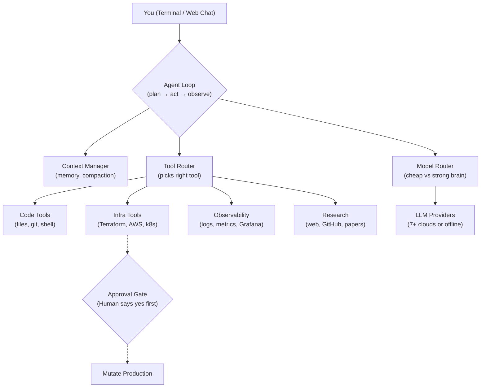

# Sentinel-Agent1: Product Requirements Document & System Design

## 1. Problem, Goal, and Audience

**Problem**
Platform, SRE, and MLOps engineers lose hours to mechanical yet risky work: debugging crash-looping deployments, writing and reviewing Terraform, chasing answers across logs and dashboards. Existing coding agents live solely in the IDE—they lack reach into cloud infrastructure or observability, and have no concept of "this action could take down production."

**Goal**
An autonomous AI teammate for platform engineering, AIOps, and MLOps that researches, writes, and safely applies infrastructure and code changes end-to-end. It mandates human approval for anything mutating production and leaves a full audit trail of every decision.

**Users**
- Platform/DevOps engineers wanting a copilot for infra work.
- On-call responders needing fast root-cause analysis plus guarded remediation.
- MLOps engineers managing model-serving infrastructure.
- Any team wanting Slack-visible, approval-gated automation instead of blind auto-apply.

**Non-Goals**
- Not a general chat product.
- Not a CI/CD replacement.
- **Never** a system that mutates production without a human "yes" (by design, not by default).

---

## 2. System Architecture & Design

One brain, four helpers, and a hard safety gate in front of anything dangerous.

### The 9-Step Agent Turn
Every turn follows a strict five-beat rhythm (Understand, Pick a brain, Decide, Safety check, Act & repeat) across nine exact steps:

1. **Cancel + Compact Check**: Did the user hit stop? Is memory near 90% full? Summarize old context if so.
2. **Doom-Loop Detection**: If the exact same tool is called repeatedly with the same inputs, break out.
3. **Model Router Picks a Model**: Classifies the step as *mechanical* or *reasoning* and routes it.
4. **Call the LLM**: One consistent call regardless of provider (via LiteLLM).
5. **Tool Calls or Done**: If no tools requested, emit final answer and stop.
6. **Tool Router Dispatches**: Route requested tools to implementation.
7. **Approval Gate Check**: If tool is on mandatory list, show a preview diff and wait for human yes.
8. **Execute**: Safe tools run (in parallel where possible).
9. **Feed Results Back**: Join outputs to conversation and loop back to step 1.

---

## 3. Two Brains: Model Routing

The system reads the plain-English description of the pending step and routes it to save costs based on keyword heuristics. Unrecognized wording defaults to the strong model for safety.

* **Mechanical (Cheap Model)**: Simple, verifiable busywork.
  * *Keywords*: `list`, `grep`, `search`, `find`, `format`, `lint`, `check`, `count`, `read`, `cat`, `head`, `tail`, `stat`
* **Reasoning (Strong Model)**: Judgment-heavy thinking.
  * *Keywords*: `plan`, `design`, `decide`, `debug`, `diagnose`, `architect`, `refactor`, `root cause`, `trade-off`, `evaluate`

---

## 4. Safety: The Approval Gate

Three actions **always** require a human. No setting, budget, or "yolo mode" can bypass this.
1. `restart_service` (Could cause a brief outage)
2. `scale_deployment` (Changes how many instances run)
3. `terraform_apply` (Rewrites real cloud resources)

**Three layers of protection:**
1. **Preview**: Shows exactly what will change before asking.
2. **Approval**: A Slack button or terminal `y/n`.
3. **Checkpoint**: Session state is snapshotted before executing so an approved action gone wrong can be rewound.

---

## 5. Toolkits & Capabilities

- **Code**: Reads, writes, edits files; searches codebase; runs local/sandboxed commands.
- **Cloud & Infra**: Terraform planning/applying, AWS/GCP management, Kubernetes and Helm.
- **Observability**: Queries logs, metrics, traces; reads Grafana.
- **Research**: Web search, GitHub lookups, ML papers with citation graphs.
- **Data & ML**: Inspects datasets (schema, validity) in one call.
- **Helper Agents**: Spawns sub-agents with separate memory for deep-digging without cluttering the main conversation.
- **Plan**: Decomposes big tasks into structured steps before acting.
- **Sandboxes**: Isolated cloud compute (CPU to H200 GPU) with upfront cost estimation.
- **Notify**: Pings team on Slack for approval, errors, or turn completion.

---

## 6. The Data Flywheel & Sessions

**Durable Sessions**: Conversations are saved, can be resumed, listed, or deleted. Mid-session you can undo a turn, force-compact memory, or rewind to an approved cloud checkpoint.

**The Flywheel**: Every session generates auto-tagged telemetry (tools used, completion state, error rates, human feedback). This powers:
- Hourly KPIs (usage metrics)
- Training data (raw multi-turn tool calling logs) to fine-tune smarter future models.

---

## 7. Cost Control & Pricing Philosophies

**Sentinel-Agent1's** pricing is a safety mechanism:
- Users set a hard dollar cap.
- Warnings fire at thresholds (e.g., $5, $10).
- AI thinking cost is tracked live.
- If cost cannot be estimated safely, it falls back to human approval.

**OpenRouter vs. Internal Gateway**:
Sentinel-Agent1 runs its own internal switchboard/gateway instead of depending on OpenRouter. The internal gateway provides provider-agnostic connections to 7+ providers (Anthropic, OpenAI, DeepSeek, Google, etc.) and local models (Ollama, vLLM) while retaining full control over billing and avoiding third-party dependencies on a product-critical path.

---

## 8. Success Metrics & Risks

**Metrics**
- 100% of mutating actions pass through approval with zero bypass incidents.
- Median time-to-resolution vs manual baseline for on-call tasks.
- Cost per task (cheap/strong split audit).
- Rewind rate trending down.

**Risks**
- The keyword-based step classifier is a heuristic; ambiguous steps might silently use a weaker model.
- Approval gate logic lives in code; refactors must be strictly reviewed.
- Slack notifications are a doorbell, not a door (the actual y/n happens in terminal/web app).
